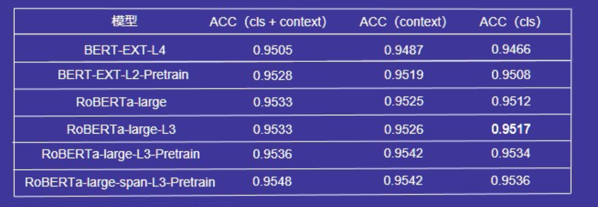

# 这是一个复现的库，非本人项目！！！
# 源项目地址：https://github.com/A-Rain/BDCI2019-Negative_Finance_Info_Judge
### 作者的实现方法请移步[原网址](https://github.com/A-Rain/BDCI2019-Negative_Finance_Info_Judge)或查看img目录下的ppt
### 结果

* 原结果


* 我的复现

| 模型 | ACC（cls+context）| ACC（context）| ACC（cls）|
---|---|---|---
BERT-EXT-L4 | 0.9534 | 0.9504|-
BERT-EXT-L2-Pretrain| 0.9539|ing|-
RoBERTa-lage|0.9541| 0.9547|-
RoBERTa-lage-L3|0.9552|0.9525-
RoBERTa-lage-L3-Pretrain|0.9512|0.9514|-
RoBERTa-lage-span-L3-Pretrain|0.9530|0.9532|-

使用的预训练模型为：bert-wwm-ext和roberta-wwm-large-ext
### 如何运行代码

source的结构如下：

```large_cls、large_nocls、small_cls、small_nocls``` 是四种模型的源代码文件。其中，```large_cls``` 和```small_cls``` 是一组，```large_nocls``` 和 ```small_nocls``` 是一组。


1. 首先将bert_ext 和 roberta_large 在金融负面信息数据集上finetuning：

   运行：pytorch-transformers（hugingface开源代码中pretrain文件）

   ```shell
   bash run_lm.sh
   ```

   注意这个是huggingface提供的原版finetuning文件，它会每30个step保存一次模型，这会存下很多无用的中间模型，为了避免磁盘空间不足，请在运行过程中实时将这些中间checkpoint删除，我们只需要最终保存的checkpoint就行.

2. 模型训练，运行：

   ```shell
   bash /small_cls/test_all_bert_ext_l2_pretrain.sh
   bash /small_cls/test_all_ext_lr4.sh
   bash /small_nocls/test_all_bert_ext_l2_pretrain.sh
   bash /small_nocls/test_all_ext_lr4.sh
   bash /large_cls/test_all_large.sh
   bash /large_cls/test_all_large_l3.sh
   bash /large_cls/test_all_large_l3_pretrain.sh
   bash /large_cls/test_all_large_span.sh
   
   bash /large_nocls/test_all_large.sh
   bash /large_nocls/test_all_large_l3.sh
   bash /large_nocls/test_all_large_l3_pretrain.sh
   bash /large_nocls/test_all_large_span_lr3.sh
   
   ```


3. 按照run.sh 文件中顺序运行文件（修改对应文件夹路径）
```bash
python preprocess.py #对原始文件进行预处理，生成五折数据（为了避免在随机划分时的顺序不同，使用了线下训练时的五折数据的顺序）
python get_result_6model.py # 获得带cls模型的投票结果 todo read
python get_nocls.py # 获得不带cls模型的结果 todo read
#隐式实体处理
python add_drop_entity #处理未在文本中出现的实体，利用训练集的先验知识构建实体白名单和黑名单，修正模型预测结果
#等价实体处理
python connector.py #修正文本中以顿号、逗号、空格作为分割的连续出现的实体，其预测结果应该一致。 todo 细节
#缩略词处理
python long_short_entity.py #  根据训练集的先验知识(一起出现的全称/缩略语对)补全test中的key_entity
#HLD / Hard Label Adaption
python cos_similar.py #通过训练集和测试集的tfidf值计算测试集中每条数据和训练集的相似度，用于后续one to one label adaption操作。
python replace.py # one to one label adaption操作，类似于faq。即将训练集的文本内容和待预测实体作为question1，key_entity作为answer。测试集每条数据的文本和待预测实体作为question2。若question2和question1的相似度达到阈值，则返回question1对应的answer修正模型结果。也可从KNN的角度理解，在KNN基础上增加了阈值设置。
#模型融合
python all_model_merge.py #利用6个不加cls的bert模型结果修正当前结果。若该6个模型中绝大多数预测结果一致且和当前结果冲突，对当前结果进行修正。todo read
#特殊处理
python post_process.py #根据训练集数据分布考虑一些special pattern。去除仅大小写不同的实体，以及以下情况：👇
#ed3a8a49	????拍拍贷还良心惠民金融？...	????拍拍贷还良心惠民金融？...	????拍拍贷;拍拍贷;惠民金融;宜信;融360	1	????拍拍贷
```